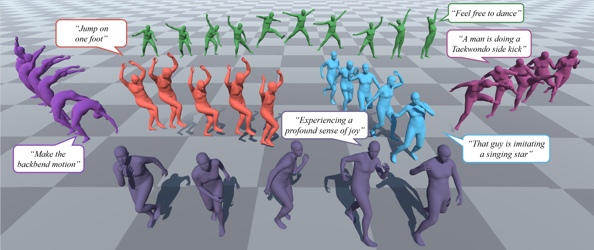

<h1>
  Plan, Posture and Go: Towards Open-World Text-to-Motion Generation
</h1>

    <a href="https://moonsliu.github.io/">
        Jinpeng Liu*1
    </a>&emsp;
    <!--  Tsinghua University -->
    <a href="https://github.com/Dai-Wenxun">
        Wenxun Dai*1
    </a>&emsp;
    <!--  Tsinghua University -->
    <a href="https://www.chunyuwang.org/">
        Chunyu Wang*2
    </a>&emsp;
    <!--  Tsinghua University -->
    <a href="https://www.linkedin.com/in/yiji-cheng-a8b922213/">
        Yiji Cheng1
    </a>&emsp;
    <!--  Tsinghua University -->
    <a href="https://andytang15.github.io/">
        Yansong Tang1
    </a>&emsp;
    <!--  Tsinghua University -->
    <a href="https://www.microsoft.com/en-us/research/people/xtong/">
        Xin Tong2
    </a>
    <!--  Tsinghua University -->
    </li>&emsp;
     
    1Tsinghua University &nbsp;&nbsp;&nbsp;&nbsp; 2Microsoft

<strong><a href='https://moonsliu.github.io/Pro-Motion/' target='_blank'>Project Page</a></strong>&emsp;
<strong><a href=''>Paper</a></strong>&emsp;

## Updates
- [2023-12] Project page released. Code coming soon! :running::running::running: